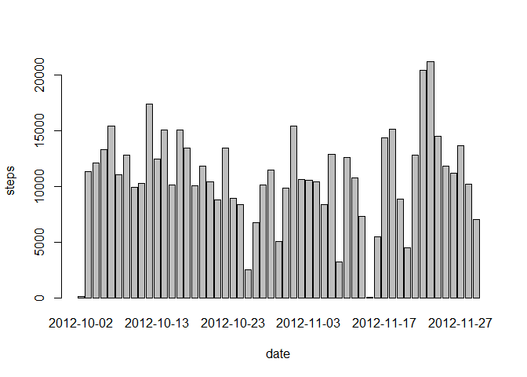
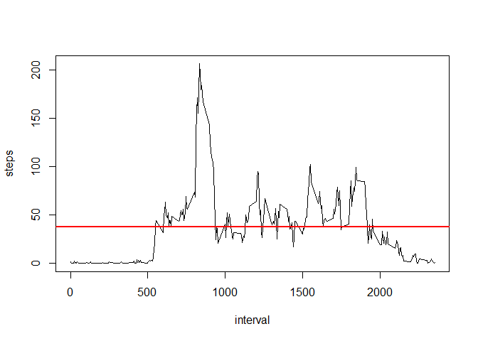
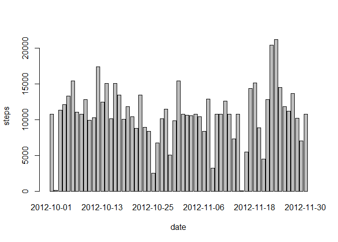
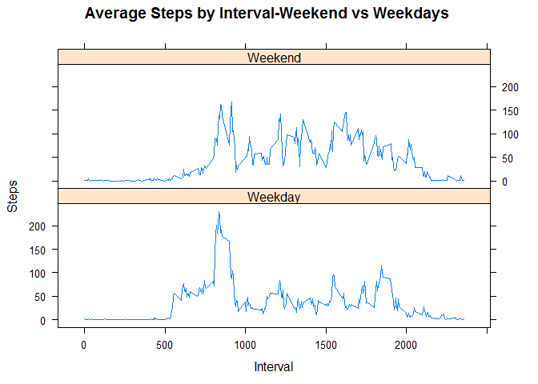

# Reproducible Research: Peer Assessment 1
by Hsiao-shan Yang

[github repo with RMarkdown source code] (https://github.com/yanghs/RepData_PeerAssessment1)

## Loading and preprocessing the data

```r
unzip("activity.zip")
activity <- read.csv("activity.csv")
```
-Format the data 

```r
library(lattice)
activity$date <- as.Date(activity$date, "%Y-%m-%d")
```

## What is mean total number of steps taken per day?
1. Make a histogram of the total number of steps taken each day

```r
steps.per.day <- aggregate(steps ~ date, data = activity, FUN = sum)
barplot(steps.per.day$steps, names.arg = steps.per.day$date, xlab = "date", ylab = "steps")
```

 


2. Calculate and report the mean and median total number of steps taken per day

```r
paste("Average Steps per Day =", mean(steps.per.day$steps, na.rm=TRUE))
```

```
## [1] "Average Steps per Day = 10766.1886792453"
```

```r
paste("Median Steps per Day =", median(steps.per.day$steps, na.rm=TRUE))
```

```
## [1] "Median Steps per Day = 10765"
```

## What is the average daily activity pattern?
- Calculate and plot steps for each 5-minute interval for all days.
- Plot the Average Number Steps per Day by Interval.

```r
steps.interval <- aggregate(steps ~ interval, data = activity, FUN = mean)
plot(steps.interval, type = "l")
abline(h=mean(steps.interval$steps, na.rm=TRUE), col="red", lwd=2)
```

 
- Find interval with interval with the maximum number of steps

```r
paste("The 5-minute interval with the maximum number of steps is", steps.interval$interval[which.max(steps.interval$steps)])
```

```
## [1] "The 5-minute interval with the maximum number of steps is 835"
```

## Imputing missing values

1. Calculate and report the total number of missing values in the dataset (i.e. the total number of rows with NAs)

```r
sum(is.na(activity$steps))
```

```
## [1] 2304
```

2. The strategy for imputing the missing data is to replace the missing value with the mean for that 5-minute interval.

3. Create a new dataset that is equal to the original dataset but with the missing data filled in.

```r
imputed_data <- transform(activity, steps = ifelse(is.na(activity$steps), steps.interval$steps[match(activity$interval, steps.interval$interval)], activity$steps))
```

4. Make a histogram of the total number of steps taken each day and Calculate and report the mean and median total number of steps taken per day. Do these values differ from the estimates from the first part of the assignment? What is the impact of imputing missing data on the estimates of the total daily number of steps?

```r
steps.per.day <- aggregate(steps ~ date, data = imputed_data, FUN = sum)
barplot(steps.per.day$steps, names.arg = steps.per.day$date, xlab = "date", ylab = "steps")
```

 

```r
paste("Average Steps per Day =", mean(steps.per.day$steps, na.rm=TRUE))
```

```
## [1] "Average Steps per Day = 10766.1886792453"
```

```r
paste("Median Steps per Day =", median(steps.per.day$steps, na.rm=TRUE))
```

```
## [1] "Median Steps per Day = 10766.1886792453"
```
The inputation does not have a significant impact on the average, but it changes the median with a insignificant dfferentce.

## Are there differences in activity patterns between weekdays and weekends?
1. Create a new factor variable in the dataset with two levels - "weekday" and "weekend" indicating whether a given date is a weekday or weekend day.

```r
day <- weekdays(activity$date)
daytype <- vector()
for (i in 1:nrow(activity)) {
    if (day[i] == "Saturday") {
        daytype[i] <- "Weekend"
    } else if (day[i] == "Sunday") {
        daytype[i] <- "Weekend"
    } else {
        daytype[i] <- "Weekday"
    }
}
imputed_data$dow <- daytype

steps.interval <- aggregate(steps ~ interval + dow, data = imputed_data, FUN = mean)
```

2. Make a panel plot containing a time series plot (i.e. type = "l") of the 5-minute interval (x-axis) and the average number of steps taken, averaged across all weekday days or weekend days (y-axis). See the README file in the GitHub repository to see an example of what this plot should look like using simulated data.

```r
library(lattice)

xyplot(steps.interval$steps ~ steps.interval$interval|steps.interval$dow, main="Average Steps by Interval-Weekend vs Weekdays ",xlab="Interval", ylab="Steps",layout=c(1,2), type="l")
```

 

